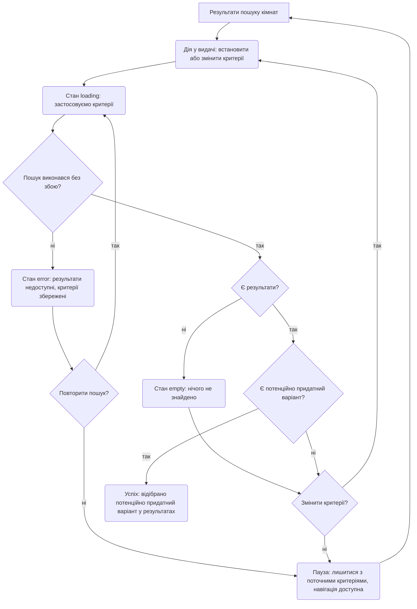
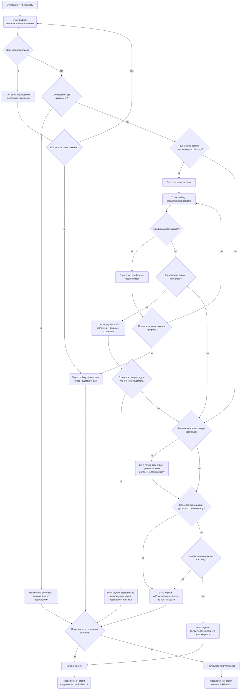
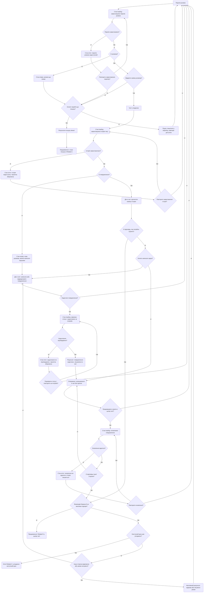
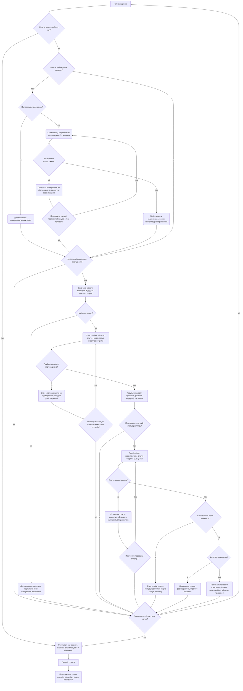

# User flows — Куток

## Межі, ролі й позначення

Це проєктна поведінка для прототипу на основі [jobs](jtbd.md), а не результат
поведінкового тестування. Main описує Марту — робочу primary-персону.
Андрій — secondary: може сам ініціювати контакт або відкрити наявну розмову;
Related 4 і 5 працюють для обох сторін з однаковими правами. Пріоритети
[персон](personas.md) залишаються гіпотезами.

Передумова цих flows — людина вже зареєструвалася й підтвердила телефон
відповідно до [продуктового брифу](CLAUDE.md#довіра-mvp). Реєстрація поза
межами цих діаграм. Додаткового gate перед чатом немає. «Звернення» — перше
повідомлення, а не формальна заявка.

- Прямокутник `A["..."]` — екран із дослівною назвою з
  [sitemap.md](sitemap.md#екрани). Повторні вузли з тією самою назвою —
  той самий екран у різних місцях flow, а не нові екрани.
- Ромб `D{"...?"}` — рішення з гілками `так` / `ні`. Оцінка умов,
  сумісності й готовності контактувати не створює додаткових кроків
  інтерфейсу: людина може прийняти ці рішення перед одним тапом «Написати».
- Заокруглений вузол `L("...")` — стан, дія всередині екрана або результат.
  `loading` — виконується конкретна операція; `error` — технічний збій;
  `empty` — запит успішний, але даних немає або профіль неповний.
  Для надсилання, block і report `empty` не потрібен.
- Очікування відповіді, несумісність, відмова й пауза — стани взаємодії.
  Очікування людини показуємо без нескінченного spinner. Негативний
  результат щодо кандидата не є технічним `error`.
- Тупик — дефект переходів, а не UI-стан. Добровільна пауза чи відмова можуть
  завершити поточну спробу; глобальна навігація й повернення до інших
  варіантів доступні. Відсутність відповіді, кімнат або доступу до сервісу —
  реальні перешкоди job, для яких є виходи; продукт не гарантує відповіді
  чи появи пропозицій.

Спільне відновлення: критерії й позицію видачі зберігаємо в поточній сесії;
це не нова сутність «збережений пошук». Ненадіслану чернетку лишаємо в чаті.
Повторне надсилання — лише за явною дією; якщо результат попередньої спроби
невідомий, спочатку звіряємо статус, щоб не створити дубль. Так само
перевіряємо невідомий результат block/report перед повтором. Глобальна
навігація доступна також під час loading/error: можна вийти, не чекаючи
запиту. Повернення з паузи — добровільна дія, не автоматичний перезапуск.

Кінцеві події: Related 1 — відібрано потенційно придатний варіант; Related 2 —
прийнято обґрунтоване рішення контактувати або не контактувати; Related 4 —
узгоджено наступний крок. Main — сторони погодили спільне проживання на
узгоджених умовах. Це результат для людей: без транзакції платформа не
підтверджує фактичне заселення. Перегляд може відбутися поза платформою;
flow не додає бронювання чи підтвердження угоди.

Вузли «Продовження» явно передають керування до іншої діаграми нижче.
Так повторно використовуються стани пошуку (Related 1), переліку розмов і
чату (Related 4), захисних дій (Related 5). Це не нові екрани й не кінці job.

## Main job — знайти взаємно прийнятний варіант і домовитися

[Формулювання job у jtbd.md](jtbd.md#main-job-продукту).
Від старту до відкриття чату — 2 навігаційні тапи, або 3 через повний
профіль. Повідомлення й домовленість потребують змінної кількості дій.

### Скорочений варіант — happy path

Це огляд основного успішного маршруту без технічних станів, відмов і
відновлення. Повна специфікація лишається в наступній діаграмі.

```mermaid
flowchart TD
    A["Результати пошуку кімнат"] --> B("Встановити критерії пошуку")
    B --> C{"Є прийнятні результати?"}
    C -->|так| D["Оголошення про кімнату"]
    D --> E{"Кімната доступна й базові умови підходять?"}
    E -->|так| F{"Потрібен повний профіль?"}
    F -->|так| G["Профіль іншої людини"]
    F -->|ні| H{"Сигнали довіри зрозумілі?"}
    G --> I{"Даних достатньо для оцінки?"}
    I -->|так| H
    H -->|так| J{"Довіри достатньо для контакту?"}
    J -->|так| K{"Побутові очікування прийнятні?"}
    K -->|так| L["Чат із людиною"]
    L --> M("Написати й надіслати повідомлення")
    M --> N{"Інша сторона відповіла?"}
    N -->|так| O{"Умови залишаються сумісними?"}
    O -->|так| P("Узгодити розмову або перегляд")
    P --> Q("Уточнити умови після перегляду")
    Q --> R{"Спільне проживання погоджено?"}
    R -->|так| S("Успіх Main: погоджено проживання на узгоджених умовах")
```

### Повний варіант — стани, відмови та відновлення

```mermaid
flowchart TD
    A["Результати пошуку кімнат"] --> LS("Стан loading: завантажуємо результати")
    LS --> QS{"Пошук завантажився?"}
    QS -->|ні| ES("Стан error: пошук недоступний, критерії збережені")
    ES --> RS{"Повторити пошук?"}
    RS -->|так| LS
    RS -->|ні| PAUSE("Пауза: спробу відкладено, навігація доступна")
    QS -->|так| HS{"Є результати?"}
    HS -->|ні| NS("Стан empty: нічого не знайдено")
    NS --> CS{"Змінити критерії?"}
    CS -->|так| A
    CS -->|ні| PAUSE
    HS -->|так| B["Оголошення про кімнату"]
    B --> LB("Стан loading: завантажуємо оголошення")
    LB --> QB{"Оголошення завантажилося?"}
    QB -->|ні| EB("Стан error: оголошення не завантажилося")
    EB --> RB{"Повторити завантаження?"}
    RB -->|так| LB
    RB -->|ні| A
    QB -->|так| AB{"Кімната ще доступна?"}
    AB -->|ні| NB("Негативний результат: оголошення зняте або кімната зайнята")
    NB --> A
    AB -->|так| TERMS{"Базові умови підходять?"}
    TERMS -->|ні| A
    TERMS -->|так| FULL{"Потрібен повний профіль?"}
    FULL -->|так| P["Профіль іншої людини"]
    FULL -->|ні| SIGNAL{"Значення сигналів довіри зрозуміле?"}
    P --> LP("Стан loading: завантажуємо профіль")
    LP --> QP{"Профіль завантажився?"}
    QP -->|ні| EP("Стан error: профіль не завантажився")
    EP --> RP{"Повторити завантаження профілю?"}
    RP -->|так| LP
    RP -->|ні| A
    QP -->|так| HP{"Даних профілю достатньо для оцінки?"}
    HP -->|ні| NP("Стан empty: профіль неповний, невідоме позначено")
    NP --> CLARIFY{"Готові уточнити невідоме в чаті?"}
    CLARIFY -->|ні| A
    CLARIFY -->|так| SIGNAL
    HP -->|так| SIGNAL
    SIGNAL -->|ні| EXPLAIN("Дія в поточному екрані: прочитати пояснення меж перевірки")
    EXPLAIN --> TRUST
    SIGNAL -->|так| TRUST{"Рівень довіри достатній для контакту?"}
    TRUST -->|ні| A
    TRUST -->|так| LIFE{"Відомі побутові очікування прийнятні?"}
    LIFE -->|ні| A
    LIFE -->|так| CONTACT{"Хочете контактувати?"}
    CONTACT -->|ні| A
    CONTACT -->|так| C["Чат із людиною"]
    C --> LC("Стан loading: завантажуємо історію чату")
    LC --> QC{"Історія завантажилася?"}
    QC -->|ні| EC("Стан error: історія недоступна, чернетка збережена")
    EC --> RC{"Повторити завантаження чату?"}
    RC -->|так| LC
    RC -->|ні| A
    QC -->|так| HC{"Є попередні повідомлення?"}
    HC -->|ні| NC("Стан empty: нова розмова, можна написати першими")
    NC --> COMPOSE("Дія в чаті: написати або відредагувати повідомлення")
    HC -->|так| COMPOSE
    COMPOSE --> SEND{"Надіслати повідомлення?"}
    SEND -->|ні| EXIT{"Перейти до інших розмов?"}
    SEND -->|так| LD("Стан loading: звіряємо статус і надсилаємо за потреби")
    LD --> QD{"Надсилання підтверджено?"}
    QD -->|ні| ED("Стан error: надсилання не підтверджене, чернетка збережена")
    ED --> RD{"Перевірити статус і повторити за потреби?"}
    RD -->|так| LD
    RD -->|ні| EXIT
    QD -->|так| WAIT("Очікування: повідомлення надіслано, залишаємося в чаті")
    WAIT --> STAY{"Продовжувати цю розмову зараз?"}
    STAY -->|ні| EXIT
    STAY -->|так| SYNC("Стан loading: оновлюємо повідомлення")
    SYNC --> SYNCOK{"Оновлення вдалося?"}
    SYNCOK -->|ні| SYNCERR("Стан error: нові повідомлення недоступні, історія лишається")
    SYNCERR --> RETRY{"Повторити оновлення?"}
    RETRY -->|так| SYNC
    RETRY -->|ні| EXIT
    SYNCOK -->|так| ANSWER{"Є відповідь іншої сторони?"}
    ANSWER -->|ні| WAIT
    ANSWER -->|так| SAFE{"Взаємодія бажана й не викликає підозри?"}
    SAFE -->|ні| SAFETY("Продовження: Related 5 у цьому чаті")
    SAFE -->|так| AGREE{"Є явна відмова або несумісні умови?"}
    AGREE -->|так| NO("Негативний результат: відмова або умови не зійшлися")
    NO --> A
    AGREE -->|ні| NEXT{"Наступний крок узгоджено?"}
    NEXT -->|ні| COMPOSE
    NEXT -->|так| STEP("Проміжний результат: домовилися про розмову або перегляд")
    STEP --> LIVING{"Після уточнень і перегляду погодили спільне проживання?"}
    LIVING -->|так| DONE("Успіх Main: люди погодили проживання на узгоджених умовах")
    LIVING -->|ні| CONTINUE{"Продовжувати узгодження з цією людиною?"}
    CONTINUE -->|так| COMPOSE
    CONTINUE -->|ні| A
    EXIT -->|так| CONV["Перелік розмов"]
    EXIT -->|ні| A
    PAUSE --> A
    CONV --> HANDOFF("Продовження: стани переліку й вибір розмови в Related 4")
```

**Рішення:** чи завантажилися пошук, оголошення, профіль та історія; чи
повторювати невдалу операцію; чи є результати й чи змінювати критерії;
чи актуальна кімната й прийнятні базові умови; чи потрібен повний профіль;
чи вистачає даних або чи готова людина уточнити невідоме; чи зрозумілі
сигнали, достатня довіра й прийнятні побутові очікування; чи контактувати;
чи надсилати й чи підтверджено надсилання; чи чекати в чаті або перейти до
інших розмов; чи вдалося оновити повідомлення й чи відповіли; чи бажана
взаємодія; чи прийнятні умови, погоджено наступний крок і спільне проживання.

**Стани:** `loading/error` пошуку, оголошення, профілю, історії, надсилання
й оновлення; `empty` видачі, неповного профілю й нового чату. Неактуальне
оголошення й відмова — негативні результати. Очікування має виходи у пошук
або розмови; оновлення не означає повторне звернення. Недостатня довіра
й несумісність повертають до інших варіантів. Пауза залишає критерії
й навігацію. Успіх — домовленість людей про проживання, без заяви про
доведене заселення. Невідомі побутові умови позначені як невідомі:
готовність уточнити їх не є підтвердженням сумісності.

## Related job 1 — звузити пошук до прийнятних варіантів

[Формулювання job у jtbd.md](jtbd.md#1-звузити-пошук-до-прийнятних-варіантів).
Primary — Марта. Job завершується на відборі результату; завантаження
оголошення й подальша оцінка описані в Main.

**Рішення:** чи виконався пошук; чи повторити запит; чи є результати;
чи є придатний варіант; чи змінити критерії. Відмова послаблювати умови
допустима — продукт не примушує приймати неприйнятний варіант.

**Стани:** `loading` застосування критеріїв; `error` невдалого запиту;
`empty` лише після успішного запиту без результатів; пауза зі збереженими
критеріями та можливістю повернутися пізніше або вийти через глобальну
навігацію; успіх — відсіяно неприйнятне й обрано потенційно придатне.

## Related job 2 — зменшити невизначеність щодо іншої сторони

[Формулювання job у jtbd.md](jtbd.md#2-зменшити-невизначеність-щодо-іншої-сторони).
Марта починає з оголошення; Андрій може почати з профілю кандидата у вже
наявній розмові. Межі сигналу показуємо в тому самому екрані: підтверджений
номер не гарантує особу, житло, наміри чи сумісність.

**Рішення:** чи завантажилися оголошення й профіль; чи повторити спробу;
чи актуальний варіант; чи достатньо контексту; чи готова людина уточнювати
невідоме; чи зрозумілі межі сигналів і достатня довіра; чи контактувати;
до якого наявного контексту повернутися.

**Стани:** `loading/error` оголошення й профілю; `empty` неповного профілю
після успішного завантаження; пояснення сигналу в поточному екрані;
негативний результат неактуального варіанта; пауза через технічну
недоступність не оголошується успіхом оцінки. Усвідомлені рішення
контактувати й не контактувати — обидва валідні результати job. Повернення
в чат після відмови контактувати не надсилає повідомлення автоматично.

## Related job 4 — перевести придатний варіант у взаємну домовленість

[Формулювання job у jtbd.md](jtbd.md#4-перевести-придатний-варіант-у-взаємну-домовленість).
Марта може ввійти напряму з оголошення/профілю. Обидві сторони можуть
повернутися через «Перелік розмов»; для Андрія це типовий вхід у вже
розпочату розмову, без обмеження його права написати першим.

**Рішення:** чи завантажився перелік і чи є розмови; чи вибрати розмову
або перейти до пошуку; чи завантажилась історія й чи є повідомлення;
чи є відповідь для оцінки або бажання написати; чи бажана взаємодія;
чи узгоджено наступний крок, чи є явна відмова/несумісність; чи надсилати;
чи підтверджено надсилання й чи повторити; чи чекати в чаті; чи вдалося
оновлення і чи надійшла відповідь.

**Стани:** `loading/error` переліку, історії, надсилання й оновлення;
`empty` нового чату або порожнього переліку; очікування без spinner;
негативний результат відмови/несумісності; пауза з навігацією;
успіх — узгоджений наступний крок, наприклад розмова чи перегляд.
Після надсилання людина лишається в чаті. Перехід до переліку добровільний;
неотримана відповідь не є ні відмовою, ні технічною помилкою.
Відновлення не стирає чернетку й не надсилає повідомлення автоматично.

## Related job 5 — не втратити контроль під час взаємодії з незнайомою людиною

[Формулювання job у jtbd.md](jtbd.md#5-не-втратити-контроль-під-час-взаємодії-з-незнайомою-людиною).
Однакова поведінка для Марти й Андрія. Вхід — відкритий чат, зокрема з
Main або Related 4; його завантаження описане вище. Вихід, блокування
й скарга — незалежні дії. Блокування не потребує скарги, скарга не блокує
автоматично, простий вихід не припиняє майбутні повідомлення.
Контекстні дії доступні й за збою історії, коли відомий співрозмовник.

**Рішення:** чи просто вийти; чи блокувати й підтвердити блокування;
чи виконалося блокування і чи повторити після перевірки статусу;
чи подавати й надсилати скаргу; чи підтверджено прийняття і чи повторити;
чи перевіряти статус; чи завантажився він, чи є оновлення й чи завершено
розгляд; чи завершити роботу з чатом. Повернення в заблокований чат не
розблоковує людину: історія, report і статус залишаються доступними.

**Стани:** скасування block/report без виконання відповідної дії;
`loading/error` блокування, надсилання скарги й отримання її статусу;
`empty` відсутності нового статусу; підтверджене блокування; прийнята
скарга; очікування розгляду; фактичний результат модерації. Збій report
не скасовує успішне блокування. Збій block не маскується повідомленням
про захист. Вихід доступний до, під час і після будь-якої операції через
глобальну навігацію. Прийняття скарги не означає покарання користувача.
Показ статусу — контекстна частина існуючого чату, без нового екрана;
деталі видимого рішення **[?]** потребують уточнення політики модерації.
